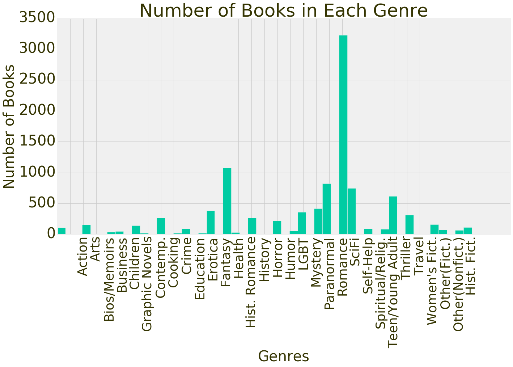
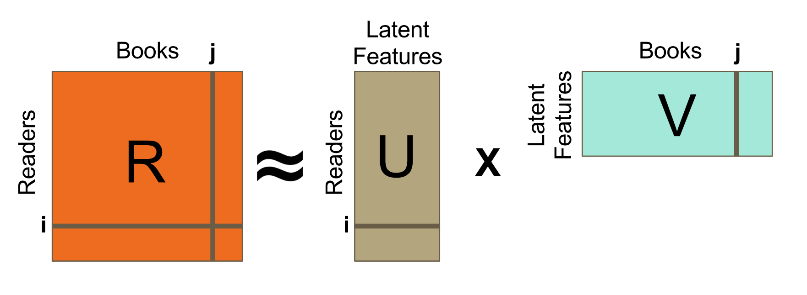
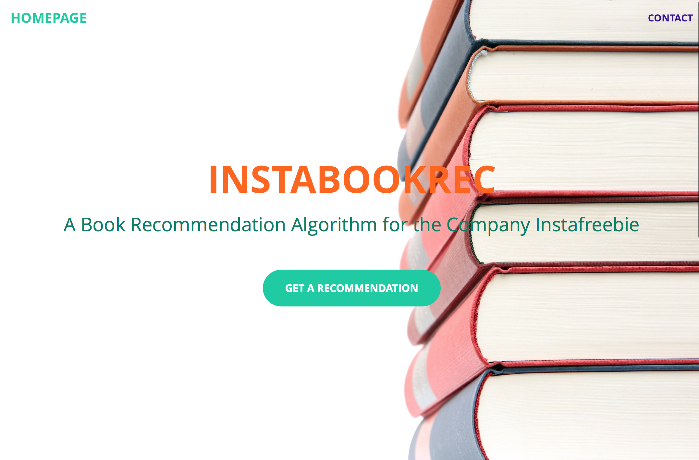
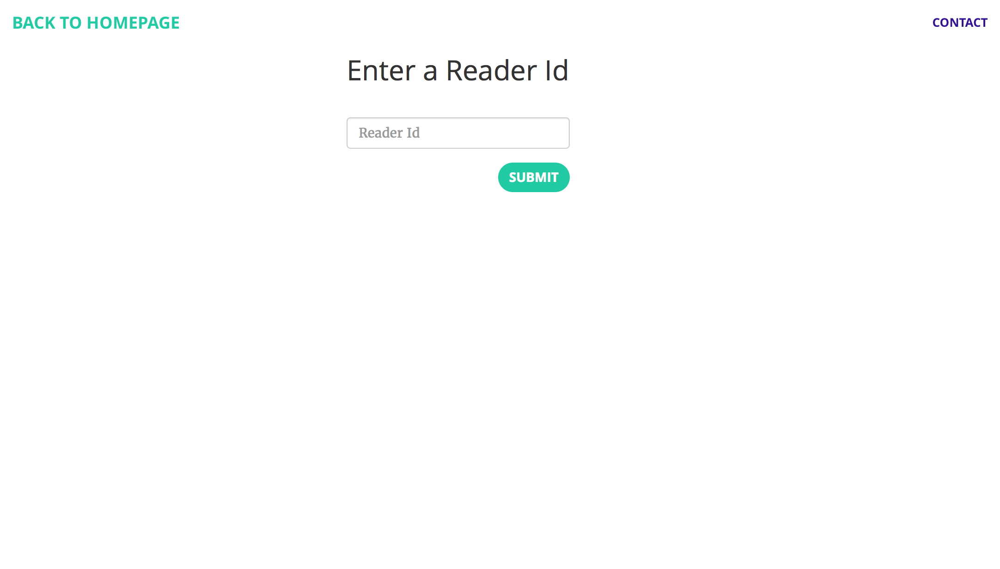
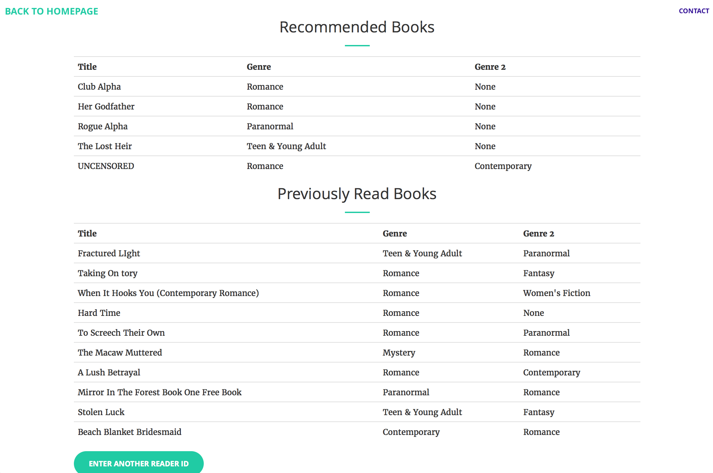
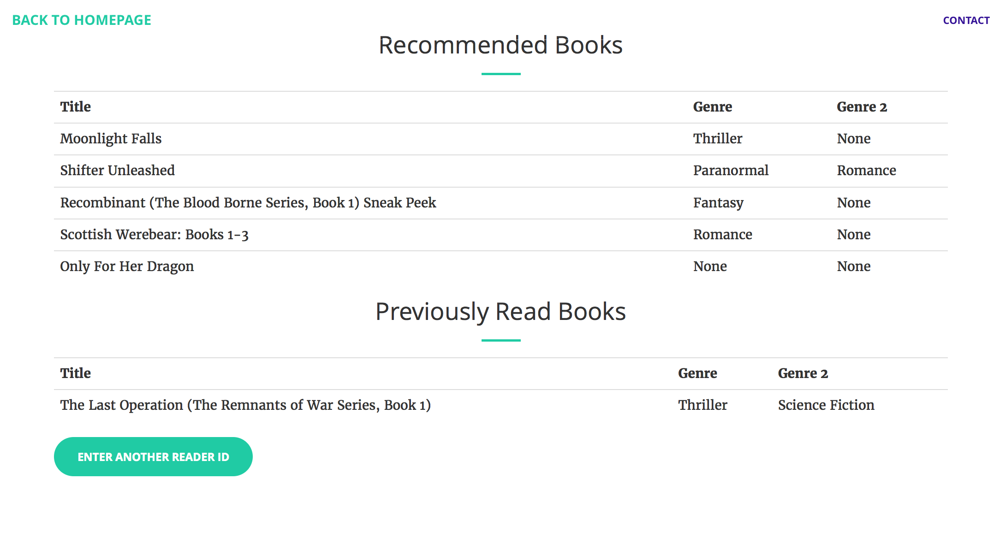

# InstaBookRec  

<!--  -->

### A Book Recommendation Algorithm for the Company Instafreebie
Galvanize Data Science Immersive - Capstone Project - March 2017

### David E Clausen
Data Scientist | Mathematician

## Table of Contents
<!-- - [Purpose](#purpose) -->
- [Overview](#overview)
- [Recommendation Systems](#recommendation-systems)
- [Data](#data)
- [Models](#models)
- [Deployment](#deployment)
- [About Me](#about-me)
- [Resources](#resources)

<!-- ## Purpose

I became a data scienctist because I wanted to use my talents to help companies succeed.  This is why I decided to work with a company for my capstone project at [Galvanize](http://www.galvanize.com).  

 -->
## Overview
I became a data scienctist because I wanted to use my talents to help companies succeed.  This is why I decided to work with a company for my capstone project at [Galvanize](http://www.galvanize.com).  

For my project I collaborated with the company [Instafreebie](https://www.instafreebie.com) to improve their book recommendation algorithm.  Instafreebie seeks to connect authors with the right readers by offering a platform for authors to distribute their work electronically and expand their readership through sharing portions of their work in exchange for email sign-ups.  

When a book is downloaded from Instafreebie, three new books are recommended to the reader.  Good book recommendations are important for the company. Better recommendations result in more downloads, which connect authors to new readers and create more business for Instafreebie.  

Their algorithm was self-described as "naive" because it did little more than make recommendations based on genre.  This algorithm resulted in a 9.5% download rate of recommendations it made.

My task was to create a recommendation algorithm that would result in more downloads.

## Recommendation Systems
Recommendation systems have become increasingly more popular in recent years as a way to increase business.  Netflix, Pandora and Amazon are just a few examples of companies that use a well defined process to make suggestions about new movies/television shows, songs/artists and products to consumers.  In a broad sense, recommendation systems predict the level of interest a user has in a new item.

There are two distinct techniques that are used to make these predictions, collaborative filtering and content-based filtering.  Collaborative filtering uses information collected from a user's past decisions, combined with information gathered from other users with similar behavior, to make recommendations.  You can think of it as a "collaboration" of many users to help out one user.  Content-based filtering systems make suggestions to a user based off of comparing descriptions of items to the user's preferences.  This method utilizes some "content" of the items to match them with a user.

Below is a general break down of the two types of recommendation systems:

1) Collaborative Filtering
- Memory-based
     + item-item similarity
     + user-user similarity

- Model-based
    + clustering
    + matrix factorization

2) Content-based Filtering

Memory-based collaborative filtering calculates similarity scores between users and items based upon the rating data of the users.  These scores are then employed to suggest items to users.  These scores must be saved and in a sense committed to "memory" in order to utilize them.

Model-based approaches to recommendation systems use machine learning algorithms to uncover correlations between users and items within a set of data.  These correlations in the data are commonly referred to as latent features and are used to make predictions for users.  This technique relies heavily on a mathematical "model" in order to make recommendations.

It is also possible to combine the collaborative and content-based approaches into one model and create a hybrid recommendation system.

## Data
Instafreebie gave me access to tables on their MySQL database.  The table with the most relevant information was a log of previously made recommendations.  There were 29,591,800 recommendations to 508,163 readers spanning 10,078 books.

###### Figure 1: The Distribution of Books between Genres

 

It was important that the recommender I built did more than just suggest books from the same genre as the book that was downloaded, otherwise it would likely perform similarly to the company's current algorithm.  There were 32 genres represented in the ten thousand books, and nearly one third of the books were from the genre of Romance.  With Romance dominating the genre distribution, it could propose a challenge to suggest books from other genres.

This log also kept track of whether or not the recommendations were downloaded by the users.  This type of data is implicit rather than explicit.  Implicit data is an observed behavior of a user in regard to an item and is typically binary (i.e. downloaded or not downloaded, clicked on or not clicked on), as opposed to explicit data, which is a conscious rating of an item by a user and is usually on some kind of a scale (i.e. 0 to 5 stars, or 1 to 10).

## Models
I wanted to create a model that would suggested some books outside of the genre of the downloaded book, but would also not solely suggest Romance novels.

I utilized the alternating least squares (ALS) algorithm in GraphLab Create and Spark to construct two different model-based collaborative filtering recommender systems.  The ALS method is an example of matrix factorization.

###### Figure 2: Matrix Factorization

<!-- Matrix R combining the two tags
combining the two tags -->
 

Matrix factorization, also called matrix decomposition, is a technique within linear algebra where a matrix is factored into a product of simpler component matrices.  

Spark and GraphLab

"Alternating least squares is a matrix factorization algorithm that takes a (reader, book)=R matrix, splits it into two matrices, a (reader, attribute)=U matrix and a (attribute, book)=V matrix - initializes V (by using average rating for each book in the first row and then entering random small numbers for the remaining elements),  holds V constant and adjusts U to minimize a cost function (least squares regression), then alternates, holds U constant and adjusts V to minimize cost function, continues until convergence or for a specified amount of iterations." - me

"In the mathematical discipline of linear algebra, a matrix decomposition or matrix factorization is a factorization of a matrix into a product of matrices." - Wikipedia

"In mathematics, factorization (also factorisation in some forms of British English) or factoring is the decomposition of an object (for example, a number, a polynomial, or a matrix) into a product of other objects, or factors, which when multiplied together give the original." - Wikipedia

Performance

## Deployment
Web App

## About Me

 

I am a Data Scientist living in Denver, Colorado. I believe in harnessing the power of computers to derive actionable insights from data in order to make more informed business decisions.

In 2013, I graduated from the University of Colorado, Boulder with a degree in Mathematics.  I spent 3 years working as the Head of Human Resources and Accounts Receivable/Payable Manager for Smiley Inc., a small construction company in Boulder that specializes in historic residential remodels and renovations.

At Galvanize, I advanced my skills in machine learning, statistical analysis, and computer programming.  I seek to fully utilize my abilities as a data scientist and mathematician in order to be a useful and effective member of a company.

#### Contact Information

Email: davideclausen@gmail.com

Linkedin: [/in/declausen](https://www.linkedin.com/in/declausen/)

## Resources

#### Similar Past Galvanize Capstone Projects

* Sal Khan - [Electronic Music Recommender](https://github.com/salmank09/musicrecommender)
* Olivia Schow - [Take-A-Hike: A Colorado Trail Recommender](https://github.com/oschow/take-a-hike)

#### Online

* Analytics Vidhya (uses GraphLab Create) - [Quick Guide to Build a Recommendation Engine in Python](https://www.analyticsvidhya.com/blog/2016/06/quick-guide-build-recommendation-engine-python/)
* Turi-code (uses GraphLab Create) - [Movie Recommender Sample Project](https://github.com/turi-code/sample-movie-recommender)
* Apache Spark - [Collaborative Filtering](https://spark.apache.org/docs/latest/ml-collaborative-filtering.html)
